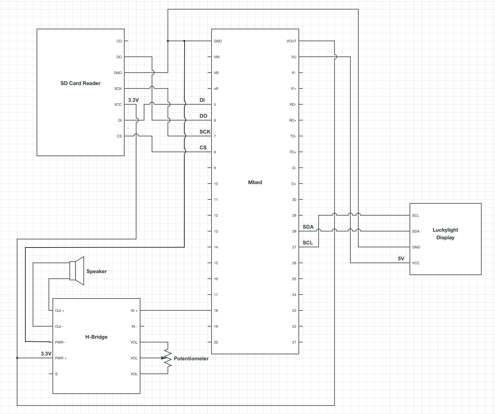

# Music Controller and FFT Display
## Team Members: Annie Luo, Dimitry Jean-Laurent, Emmy Perez, Shyam Patel


# Project Description
For this project, we developed a music controller that consisted of a C# GUI and an mbed setup. In the GUI, the user can select a song from a library of options stored on the SD card and based upon this selection, a FFT analysis is performed on the .wav file and the output is displayed on an 8x8 LED display. For the display, we created 5 different outputs that would be shown based upon the frequency range that was outputted from the FFT analysis. In order to accomplish all of these parts at once, RTOS was used to thread each component.


## Library Used
  - mbed.h
  - SDFileSystem.h
  - wave_player.h
  - Adafruit_LEDBackpack.h
  - Adafruit_GFX.h
  - rtos.h
  - FFT.h


## Parts Used
  - Speaker
  - Class D Audio Amplifier
  - Potentiometer
  - SD Card Reader
  - Adafruit LuckyLight 8x8 LED Display
  - mbed LPC1768


## Wiring Diagram



## C# GUI
In the GUI, you can choose the COM port for the SD card to read in the song library and select what song you would like to listen to. After making your selection, the GUI then displays the song name while the song is playing.

```
using System;
      using System.Collections.Generic;
      using System.ComponentModel;
      using System.Data;
      using System.Drawing;
      using System.Linq;
      using System.Text;
      using System.Threading.Tasks;
      using System.Windows.Forms;
      using System.IO.Ports;
      using System.Diagnostics;

      namespace Final_Project_4180
      {
        public partial class Form1 : Form
        {
          private String[] portNames;
          private String[] songs = { "africa-toto", "around_the_world-atc", "beautiful_life-ace_of_base", "dont_speak-no_doubt", "my-love", "Song1_test" };
          private bool play = false;
          private String song = "";
      
          public Form1()
          {
            InitializeComponent();
          }

          private void comboBox1_SelectedValueChanged(object sender, EventArgs e)
          {
            serialPort1.PortName = comboBox1.Text;
          }

          private void Form1_Load(object sender, EventArgs e)
          {
            Debug.Print("hello 4180 project!");
            try
            {
                Debug.Print("init load");
                portNames = SerialPort.GetPortNames();
                comboBox1.Items.AddRange(portNames);
                comboBox1.SelectedIndex = 0;
                Debug.Print("end load");
            }
            catch (Exception err)
            {
                Debug.Print("loading error: " + err.Message);
            }
            Debug.Print("Connected Mbed to " + comboBox1.Text);


          }

          private void comboBox1_TextUpdate(object sender, EventArgs e)
          {
            if (serialPort1.IsOpen) serialPort1.Close();
            serialPort1.PortName = comboBox1.Text;
            serialPort1.Open();
          }

          private void Form1_FormClosed(object sender, FormClosedEventArgs e)
          {
            serialPort1.Close();
          }

          private void comboBox2_SelectedValueChanged(object sender, EventArgs e)
          {
            switch (comboBox2.SelectedItem.ToString())
            {
                case "Africa":
                    Debug.Print("africa-toto");
                    song = "!1";
                    break;
                case "Around the World":
                    Debug.Print("around_the_world-atc");
                    song = "!2";
                    break;
                case "Beautiful Life":
                    Debug.Print("beautiful_life-ace_of_base");
                    song = "!3";
                    break;
                case "Don't Speak":
                    Debug.Print("dont_speak-no_doubt");
                    song = "!4";
                    break;
                case "My Love":
                    Debug.Print("my-love");
                    song = "!5";
                    break;
                case "Song1_test":
                    Debug.Print("Song1_test");
                    song = "!6";
                    break;
                default:
                    break;
            }
            label3.Text = comboBox2.SelectedItem.ToString();
            if (serialPort1.IsOpen)
            {
                serialPort1.Write(song);
            }
            else
            {
                try
                {
                    serialPort1.Open();
                } catch (Exception err)
                {
                    Debug.Print("Error: " + err.Message);
                }
            }
          }

          private void button1_Click(object sender, EventArgs e)
          {
            play = !play;
            if (serialPort1.IsOpen)
            {
                if (play == true)
                {
                    serialPort1.Write("!P");
                }
                else
                {
                    serialPort1.Write("!S");
                }
            }
            else
            {
                try
                {
                    serialPort1.Open();
                } catch (Exception err)
                {
                    Debug.Print("Error: " + err.Message);
                }
            }
          }
        }
      }
```


## mbed Setup and FFT
We have 2 threads in our program. One that that takes in data from the C# GUI and plays the music selection on the speaker and another that runs an FFT analysis on the music and then determines what frequency bin that the output falls into and displays it. In order to do the FFT analysis on the data we ran into some issues grabbing data in the form of an array from our .wav file in order to run this through the FFT library that we were using. To fix this issue, we had to first create an .txt file containing an array of values from the .wav file using the WAVToCode software and place this on our SD card. From there, we were able to sample the data and perform our calculations for the output.

```
      #include 
      int main() { 
        printf("Hello Geeks"); 
      } 
```

You can use the [editor on GitHub](https://github.com/shyamp229/ECE4180_Project/edit/gh-pages/index.md) to maintain and preview the content for your website in Markdown files.

Whenever you commit to this repository, GitHub Pages will run [Jekyll](https://jekyllrb.com/) to rebuild the pages in your site, from the content in your Markdown files.

### Markdown

Markdown is a lightweight and easy-to-use syntax for styling your writing. It includes conventions for

```markdown
Syntax highlighted code block

# Header 1
## Header 2
### Header 3

- Bulleted
- List

1. Numbered
2. List

**Bold** and _Italic_ and `Code` text

[Link](url) and 
```

For more details see [GitHub Flavored Markdown](https://guides.github.com/features/mastering-markdown/).

### Jekyll Themes

Your Pages site will use the layout and styles from the Jekyll theme you have selected in your [repository settings](https://github.com/shyamp229/ECE4180_Project/settings). The name of this theme is saved in the Jekyll `_config.yml` configuration file.

### Support or Contact

Having trouble with Pages? Check out our [documentation](https://docs.github.com/categories/github-pages-basics/) or [contact support](https://github.com/contact) and we’ll help you sort it out.
